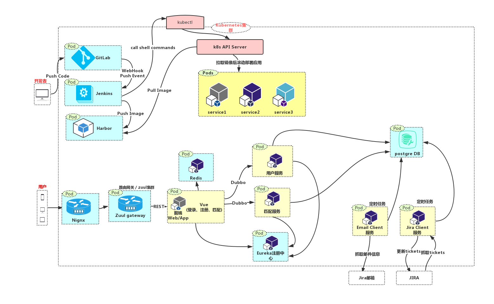

# JIRA Connector
## 项目结构

## 项目微服务
### Vue Web/App 服务
- 登录界面
- 注册界面
- 用户信息展示界面
- 匹配界面

### 用户服务
- 提供用户数据操作
- 无状态，无 session，使用 Redis 缓存保存用户信息

### 匹配服务
- 从 DB 获取邮件信息列表
- 从 DB 获取 jira ticket 信息列表
- 信息匹配操作，将匹配成功的 tickets 设为待更新状态

### Email Client 服务
- 定时抓取 jira 助手邮箱里的邮件存入DB

### Jira Client 服务
- 定时抓取 jira 中的最新 tickets 存入 DB
- 读取待更新状态的 tickets 信息，并更新到 jira

## 通讯协议
### RESTful 的 http 协议、RPC 协议
- 微服务中使用了 Vue、Java 进行开发
- Java 间主要使用 RESTful http 协议 和 拥有服务治理能力的 Dubbo RPC 框架。

## 基础服务
### API Gateway
- Zuul 路由网关

### 服务注册中心
- Eureka 注册中心

### 代码托管
- GitLab

### 持续集成
- Jenkins

### 镜像仓库
- Harbor

### 服务编排
- Kubernetes
